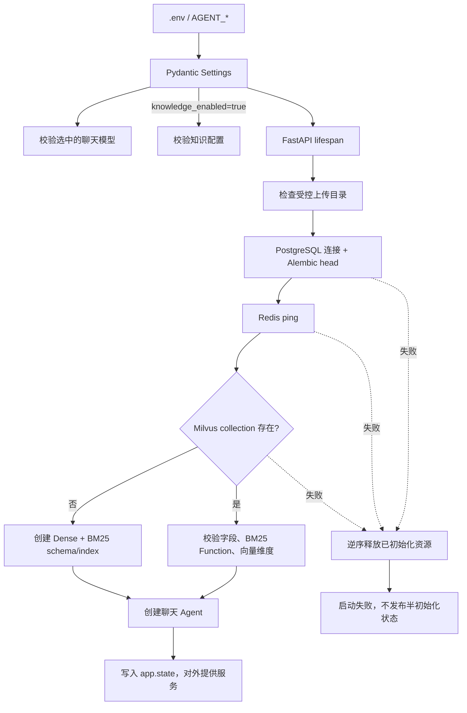
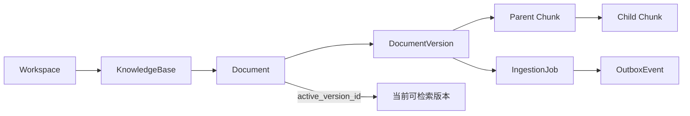
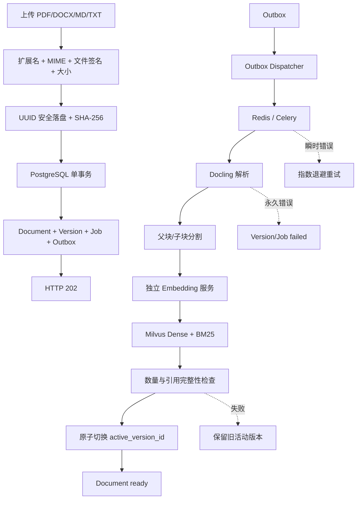
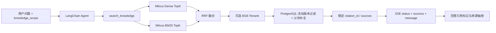

# 原生知识库链路说明

- 当前修订范围：`TASK-019` 知识基础设施基线
- 当前状态：本地实现已完成，真实容器验证仍待 Docker 环境
- 阅读顺序：先看“启动链路”，再看“数据模型”，最后看“后续完整 RAG 链路”

## 1. 当前已经实现的启动链路



关键原则：

1. `AGENT_KNOWLEDGE_ENABLED=false` 时完全跳过 PostgreSQL、Redis、Milvus 和文件目录初始化，原聊天链路保持可用。
2. 启用知识库后，配置错误、迁移版本不一致、连接失败或 Milvus schema 不兼容都会让应用安全停止。
3. Milvus collection 仅在不存在时创建；已有 collection 不匹配时不会被删除或覆盖。
4. 所有检查成功后才把资源发布到 `app.state`；失败时外部请求看不到半初始化对象。
5. 底层异常不会直接作为外部错误传播，避免数据库连接串、Token 等敏感信息泄露。

对应代码：

- 配置加载与条件校验：`src/agent_api/core/config.py`
- FastAPI 启停编排：`src/agent_api/core/lifespan.py`
- PostgreSQL/Redis/Milvus 检查：`src/agent_api/knowledge/infrastructure/startup.py`
- 安全本地文件存储：`src/agent_api/knowledge/infrastructure/storage/local.py`

## 2. PostgreSQL 数据与恢复链路



各对象职责：

| 对象 | 作用 |
| --- | --- |
| `Workspace` | 数据隔离边界；首版迁移创建固定工作区 |
| `KnowledgeBase` | 保存知识库信息及分块、检索配置 |
| `Document` | 用户看到的文档；`active_version_id` 决定在线版本 |
| `DocumentVersion` | 一次不可变处理版本，记录文件哈希、解析器和 Embedding 指纹 |
| `Chunk` | PostgreSQL 中的父子块正文与页码/标题路径；只有子块进入 Milvus |
| `IngestionJob` | 处理阶段、心跳、重试次数、幂等键和错误引用 |
| `OutboxEvent` | 与业务记录同事务提交，确保 Redis 暂时不可用时任务仍可恢复 |

PostgreSQL 是事实源，Milvus 是可重建索引。即使 Milvus 数据被清空，也应当能从 PostgreSQL 中的活动版本和子块重新构建。

## 3. 本地文件存储链路

```text
上传流（TASK-020）
  -> API 生成 UUID
  -> 只保留白名单后缀 .pdf/.docx/.md/.txt
  -> 写入 <storage_root>/<uuid>.<suffix>.part
  -> 原子替换为最终文件
```

- 原始文件名只用于展示，不参与磁盘路径拼接。
- 存储根目录不能直接指向项目根目录或用户主目录。
- 所有解析后的路径必须仍位于 `storage_root` 内。
- 删除是幂等的，补偿任务可以安全重复执行。

## 4. 后续完整文档入库链路

下面是已批准但尚未全部实现的 `TASK-020` 链路。它建立在本文件前述基础设施之上：



核心一致性规则：API 必须先提交 PostgreSQL 事务再返回 `202`；队列投递失败由 Outbox 恢复。新版本只有在 Milvus 写入和完整性检查成功后才能切换为活动版本，失败时旧版本继续服务。

## 5. 后续 Agent 检索与引用链路

该链路由 `TASK-022` 和 `TASK-023` 实现，目前仅作为已批准的接口方向：



检索工具只读，不允许 Agent 上传、删除或修改知识；没有有效命中时返回结构化的无结果状态，不能生成虚假引用。

## 6. 任务与链路对应关系

| 任务 | 链路范围 | 当前状态 |
| --- | --- | --- |
| `TASK-019` | 配置、PostgreSQL schema、存储、Redis/Milvus 启动检查 | `verifying`，等待 Docker 容器证据 |
| `TASK-020` | 上传、Outbox/Celery、Docling、父子分块、Embedding、版本切换 | `todo` |
| `TASK-021` | 知识库和文档管理页面 | `todo` |
| `TASK-022` | Dense + BM25 + RRF/Rerank、三个 Agent 工具 | `todo` |
| `TASK-023` | 会话知识范围、SSE sources、引用展示 | `todo` |
| `TASK-024` | 恢复、安全、故障注入和可观测性 | `todo` |
| `TASK-025` | 全链路验收与检索评测 | `todo` |
| `TASK-026` | Wiki 后续设计 | `proposed`，当前不实施 |
